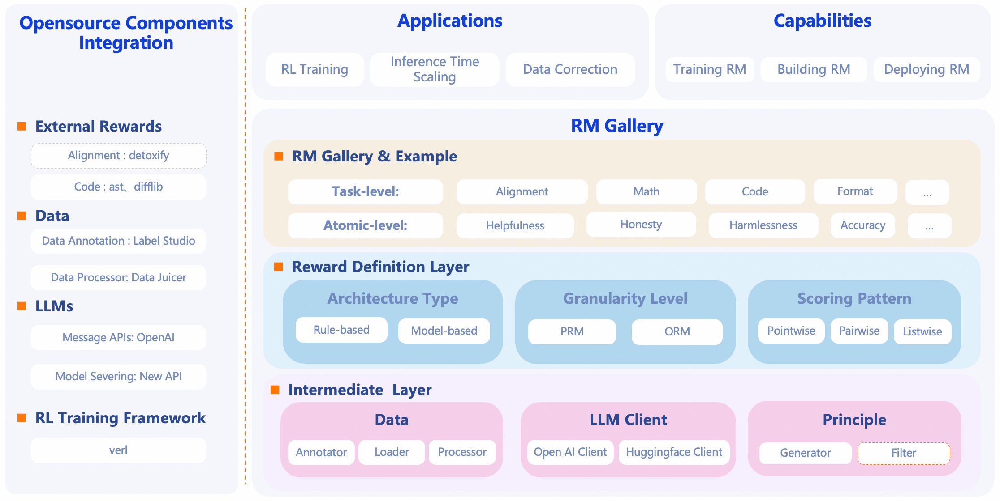

<!-- # RM-Gallery: A One-Stop Reward Model Platform -->
English | [**中文**](./README_ZH.md)
<h2 align="center">RM-Gallery: A One-Stop Reward Model Platform</h2>

[](https://pypi.org/project/rm-gallery/)
[](https://pypi.org/project/rm-gallery/)
[](./LICENSE)
[]()
[]()
[]()

----
## 📢 News
- **[2025-06-XX]** We release RM Gallery v0.1.0 now, which is also available in [PyPI](https://pypi.org/simple/rm-gallery/)!
----

## 🌟 Why RM-Gallery?

RM-Gallery is a one-stop platform for training, building and operationalizing reward models. It provides a comprehensive solution for implementing reward models at both task-level and component-level, with high-throughput and fault-tolerant capabilities.

<p align="center">
 
</p>

### Training RM
- **Integrated RM Training Pipeline**: Provides an RL-based framework for training reasoning reward models, compatible with popular frameworks (e.g., verl, OpenRLHF), and offers examples for integrating RM-Gallery into the framework.

### Building RM
- **Unified Reward Model Architecture**: Flexible implementation of reward models through standardized interfaces, supporting various architectures (model-based/free), reward formats (scalar/critique), and scoring patterns (pointwise/listwise/pairwise)

- **Comprehensive RM Gallery**: Provides a rich collection of ready-to-use Reward Model instances for diverse tasks (e.g., math, coding, preference alignment, agent) with both task-level(RMComposition) and component-level(RewardModel). Users can directly apply RMComposition for specific tasks or assemble custom RMComposition via component-level RewardModel.

- **Principle-Critic-Score Paradigm**: Adopts the Principle+Critic+Score-based reasoning Reward Model  paradigm, offering best practices to help users generate principles with limited preference data.

### Operationalizing RM

- **Multiple Usage Scenarios**: Covers multiple Reward Model (RM) usage scenarios with detailed best practices, including Training with Rewards (e.g., post-training), Inference with Rewards (e.g., Best-of-N，refinement)

- **High-Performance RM Serving**: Leverages the New API platform to deliver high-throughput, fault-tolerant reward model serving, enhancing feedback efficiency.


## 📥 Installation
> RM Gallery requires **Python 3.10** or higher.


### Install From source

```bash
# Pull the source code from GitHub
git clone https://github.com/modelscope/rm-gallery.git

# Install the package in editable mode
pip install -e .
```

### Install From PyPi

```bash
pip install rm-gallery
```

## 🚀 Quick Start
<strong> 🚀 🚀 Build RM with one-line code </strong>

```python
#Initialize using the registry pattern
rm = RewardRegistry.get("Your RM's Registry Name")(name="demo_rm")
```
For complete basic usage of RM-Gallery, please refer to [Quick Start](docs/quick_start.ipynb).


## 📚 Documentation
- Tutorial:
    - data
        - [data pipeline](docs/tutorial/data/pipeline.ipynb)
        - [data annotator](docs/tutorial/data/annotation.ipynb)
        - [data loader](docs/tutorial/data/load.ipynb)
        - [data processor](docs/tutorial/data/process.ipynb)
    - training rm
        - [training a reasoning reward model](docs/tutorial/training_rm/pointwise.ipynb)

    - building rm
        - [overview](docs/tutorial/building_rm/overview.ipynb)
        - [ready-to-use RMs](docs/tutorial/building_rm/ready2use.ipynb)
        - [building a custom RM](docs/tutorial/building_rm/customization.ipynb)
        - [auto principle](docs/tutorial/building_rm/customization.ipynb)
    - rm serving
        - [High-Performance RM Serving](docs/tutorial/rm_serving/rm_server.md)

    - rm application
        - [post training](docs/tutorial/rm_application/post_training.ipynb)
        - [best-of-n](docs/tutorial/rm_application/best_of_n.ipynb)
        - [refinement](docs/tutorial/rm_application/refinement.ipynb)


## 🤝 Contribute

Contributions are always encouraged!

We highly recommend install pre-commit hooks in this repo before committing pull requests.
These hooks are small house-keeping scripts executed every time you make a git commit,
which will take care of the formatting and linting automatically.
```shell
pip install -e .
pre-commit install
```

Please refer to our [Contribution Guide](./docs/contribution.md) for more details.

## 📝 Citation

Reference to cite if you use RM-Gallery in a paper:

```
@software{
author = {GM-Gallery},
month = {06},
title = {GM-Gallery},
url = {},
year = {2025}
}
```