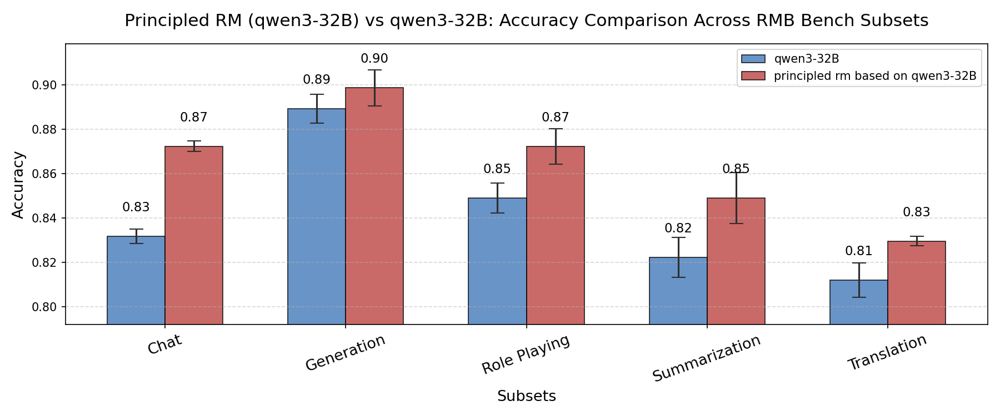

<!-- # RM-Gallery: A One-Stop Reward Model Platform -->
English | [**中文**](./README_zh.md)
<h2 align="center">RM-Gallery: A One-Stop Reward Model Platform</h2>

[](https://pypi.org/project/rm-gallery/)
[](https://pypi.org/project/rm-gallery/)
[](https://modelscope.github.io/RM-Gallery/)

----

## 🗂️ Table of Contents
- [📢 News](#-news)
- [🌟 Why RM-Gallery?](#-why-rm-gallery)
- [📥 Installation](#-installation)
- [🚀 RM Gallery Walkthrough](#-rm-gallery-walkthrough)
  - [🏋️‍♂️ Training RM](#-training-rm)
  - [🏗️ Building RM](#-building-rm)
    -  [🧩 Use Built-in RMs Directly](#-use-built-in-rms-directly)
    - [🛠️ Building Custom RMs](#-building-custom-rms)
  - [🧪 Evaluating with Reward Model](#-evaluating-with-reward-model)
    - [⚡ High-Performance RM Serving](#-high-performance-rm-serving)
  - [🛠️ Reward Applications](#-reward-applications)
- [📚 Documentation](#-documentation)
- [🤝 Contribute](#-contribute)
- [📝 Citation](#-citation)

----

## 📢 News
- **[2025-07-09]** We release RM Gallery v0.1.0 now, which is also available in [PyPI](https://pypi.org/simple/rm-gallery/)!
----

## 🌟 Why RM-Gallery?

RM-Gallery is a one-stop platform for training, building and applying reward models. It provides a comprehensive solution for implementing reward models at both task-level and atomic-level, with high-throughput and fault-tolerant capabilities.

<p align="center">
 
 <br/>
 <em>RM-Gallery Framework </em>
</p>

### 🏋️‍♂️ Training RM
- **Integrated RM Training Pipeline**: Provides an RL-based framework for training reasoning reward models, compatible with popular frameworks (e.g., verl), and offers examples for integrating RM-Gallery into the framework.
<p align="center">
  
  <br/>
  <em>RM Training Pipeline improves accuracy on RM Bench</em>
</p>
This image demonstrates the effectiveness of the RM Training Pipeline. On RM Bench, after more than 80 training steps, the accuracy improved from around 55.8% with the baseline model (Qwen2.5-14B) to approximately 62.5%.

### 🏗️ Building RM
- **Unified Reward Model Architecture**: Flexible implementation of reward models through standardized interfaces, supporting various architectures (model-based/free), reward formats (scalar/critique), and scoring patterns (pointwise/listwise/pairwise)

- **Comprehensive RM Gallery**: Provides a rich collection of ready-to-use Reward Model instances for diverse tasks (e.g., math, coding, preference alignment) with both task-level(RMComposition) and component-level(RewardModel). Users can directly apply RMComposition/RewardModel for specific tasks or assemble custom RMComposition via component-level RewardModel.

- **Rubric-Critic-Score Paradigm**: Adopts the Rubric+Critic+Score-based reasoning Reward Model  paradigm, offering best practices to help users generate rubrics with limited preference data.

<div style="display: flex; flex-wrap: wrap;">
  
  
</div>
The two images above show that after applying the Rubric+Critic+Score paradigm and adding 1–3 rubrics to the base model (Qwen3-32B), there were significant improvements on both RewardBench2 and RMB-pairwise.

### 🛠️ Applying RM

- **Multiple Usage Scenarios**: Covers multiple Reward Model (RM) usage scenarios with detailed best practices, including Training with Rewards (e.g., post-training), Inference with Rewards (e.g., Best-of-N，data-correction)

- **High-Performance RM Serving**: Leverages the New API platform to deliver high-throughput, fault-tolerant reward model serving, enhancing feedback efficiency.


## 📥 Installation
> RM Gallery requires **Python >= 3.10 and < 3.13**


### 📦 Install From source

```bash
# Pull the source code from GitHub
git clone https://github.com/modelscope/RM-Gallery.git

# Install the package
pip install .
```

### Install From PyPi

```bash
pip install rm-gallery
```

## 🚀 Quick Start

### Your First Reward Model

```python
from rm_gallery.core.reward.registry import RewardRegistry

# 1. Choose a pre-built reward model
rm = RewardRegistry.get("safety_listwise_reward")

# 2. Prepare your data
from rm_gallery.core.data.schema import DataSample
sample = DataSample(...)  # See docs for details

# 3. Evaluate
result = rm.evaluate(sample)
print(result)
```

**That's it!** 🎉

👉 **[5-Minute Quickstart Guide](https://modelscope.github.io/RM-Gallery/quickstart/)** - Get started in minutes

👉 **[Interactive Notebooks](./examples/)** - Try it hands-on


## 📖 Key Features

### 🏗️ Building Reward Models

Choose from **35+ pre-built reward models** or create your own:

```python
# Use pre-built models
rm = RewardRegistry.get("math_correctness_reward")
rm = RewardRegistry.get("code_quality_reward")
rm = RewardRegistry.get("helpfulness_listwise_reward")

# Or build custom models
class CustomReward(BasePointWiseReward):
    def _evaluate(self, sample, **kwargs):
        # Your custom logic here
        return RewardResult(...)
```

📚 **[See all available reward models →](https://modelscope.github.io/RM-Gallery/library/rm_library/)**

### 🏋️‍♂️ Training Reward Models

Train your own reward models with VERL framework:

```bash
# Prepare data and launch training
cd examples/train/pointwise
./run_pointwise.sh
```

📚 **[Training guide →](https://modelscope.github.io/RM-Gallery/tutorial/training_rm/overview/)**

### 🧪 Evaluating on Benchmarks

Test your models on standard benchmarks:

- **RewardBench2** - Latest reward model benchmark
- **RM-Bench** - Comprehensive evaluation
- **Conflict Detector** - Detect evaluation conflicts
- **JudgeBench** - Judge capability evaluation

📚 **[Evaluation guide →](https://modelscope.github.io/RM-Gallery/tutorial/evaluation/overview/)**

### 🛠️ Real-World Applications

- **Best-of-N Selection** - Choose the best from multiple responses
- **Data Refinement** - Improve data quality with reward feedback
- **Post Training (RLHF)** - Integrate with reinforcement learning
- **High-Performance Serving** - Deploy as scalable service

📚 **[Application guides →](https://modelscope.github.io/RM-Gallery/)**


## 📚 Documentation

**📖 [Complete Documentation](https://modelscope.github.io/RM-Gallery/)** - Full documentation site

### Quick Links

- **[5-Minute Quickstart](https://modelscope.github.io/RM-Gallery/quickstart/)** - Get started fast
- **[Interactive Examples](./examples/)** - Hands-on Jupyter notebooks
- **[Building Custom RMs](https://modelscope.github.io/RM-Gallery/tutorial/building_rm/custom_reward/)** - Create your own
- **[Training Guide](https://modelscope.github.io/RM-Gallery/tutorial/training_rm/overview/)** - Train reward models
- **[API Reference](https://modelscope.github.io/RM-Gallery/api_reference/)** - Complete API docs


## 🤝 Contribute

Contributions are always encouraged!

We highly recommend install pre-commit hooks in this repo before committing pull requests.
These hooks are small house-keeping scripts executed every time you make a git commit,
which will take care of the formatting and linting automatically.
```shell
pip install -e .
pre-commit install
```

Please refer to our [Contribution Guide](./docs/contribution.md) for more details.

## 📝 Citation

Reference to cite if you use RM-Gallery in a paper:

```
@software{
title = {RM-Gallery: A One-Stop Reward Model Platform},
author = {The RM-Gallery Team},
url = {https://github.com/modelscope/RM-Gallery},
month = {07},
year = {2025}
}
```
