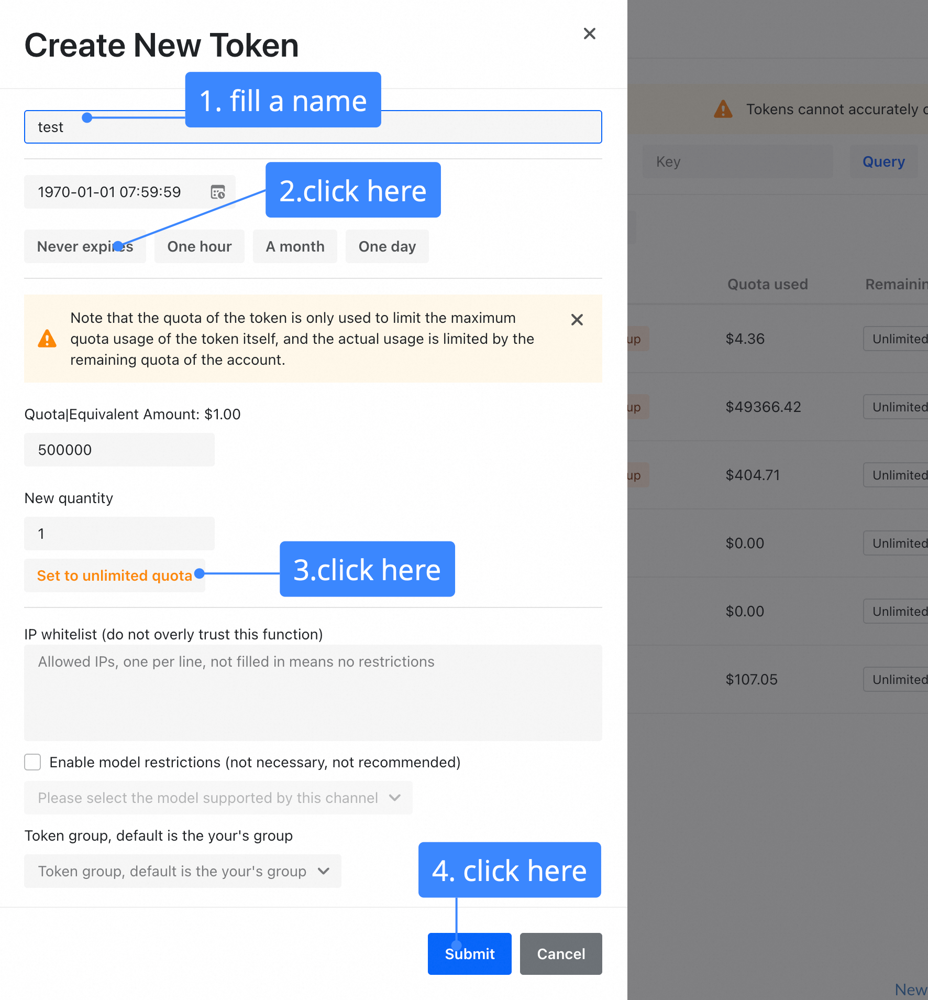

# Tutorial: Deploying a High-Performance RM Serving Platform with New API

This tutorial will guide you through deploying [New API](https://github.com/Calcium-Ion/new-api) as a high-performance serving gateway for your Reward Models (RMs) created with RM-Gallery.

## Why Use `new-api` for RM Serving?

In a production environment, simply running a reward model as a script is not enough. You need a robust system to manage, scale, and monitor it. `new-api` provides a powerful solution, acting as a unified gateway for all your AI models, including the RMs you've built. By deploying your RMs behind `new-api`, you gain several key advantages:

### 1. Unified Management and Standardized Access

Real-world applications often require multiple reward models for different tasks (e.g., a math-specific RM, a coding RM, and a general helpfulness RM). `new-api` allows you to consolidate all these models under a single platform.

- **Centralized Control Panel:** Manage all your models, whether they are hosted locally, on different cloud servers, or from various providers, through one intuitive web interface.
- **Standardized API:** It provides an OpenAI-compatible API format. This means you can interact with any of your reward models using the same familiar request/response structure, dramatically simplifying integration with other applications.

### 2. High Performance, Scalability, and Reliability

`new-api` is designed for high-throughput scenarios, ensuring your reward model service remains responsive and available even under heavy load.

- **Load Balancing:** Distribute incoming requests across multiple instances of your reward model. If you have several servers running the same RM, `new-api` can balance the traffic between them, preventing any single instance from being overloaded.
- **Channel Weighting & Retries:** You can set priorities or weights for different model channels and configure automatic retries. If one model endpoint fails, `new-api` can automatically reroute the request to a backup, ensuring high availability.

### 3. Multi-User Support and Granular Access Control

When your reward model is used by different teams, applications, or end-users, you need a secure way to manage access.

- **API Key Management:** Generate unique API keys (tokens) for each user or application. This allows you to track usage and control access granularly.
- **Quota and Rate Limiting:** Prevent abuse and manage costs by setting usage quotas (e.g., number of requests or token count) and rate limits for each API key.
- **Model Permissions:** Restrict which models a specific API key can access. For example, you can grant one team access to only the coding RM, while another gets access to all models.

### 4. Cost-Effectiveness and Monitoring

- **Built-in Caching:** `new-api` can cache responses to identical requests. If the same input is sent to your reward model multiple times, the cached result is returned instantly, saving computation time and cost.
- **Usage Dashboard:** The platform provides a clear dashboard to monitor usage statistics, helping you understand which models are being used most frequently and by whom.

By leveraging these features, `new-api` transforms your reward models from standalone components into a production-ready, scalable, and manageable service. The rest of this tutorial will show you how to set it up.

## Prerequisites

Before you start, make sure you have the following tools installed on your system:

- **Docker:** To run the `new-api` container. [Install Docker](https://docs.docker.com/get-docker/).
- **Docker Compose:** To easily manage the Docker container configuration. [Install Docker Compose](https://docs.docker.com/compose/install/).

You should also have a reward model from the RM-Gallery that is running and accessible via an HTTP endpoint (e.g., `http://localhost:8000`).

## Step-by-Step Deployment

We will use Docker Compose to deploy `new-api`. This is the recommended approach for a clean and manageable setup.

### 1. Create a `docker-compose.yml` File

Create a new directory for your `new-api` instance and create a file named `docker-compose.yml` inside it.

```bash
mkdir my-rm-gateway
cd my-rm-gateway
```

You can use the example `docker-compose.yml` we have provided. You can either download it or copy its contents into the file you just created.

**File: `docker-compose.yml`**
```yaml
version: '3.9'

services:
  new-api:
    image: calciumion/new-api:latest
    container_name: rm_gallery_new_api
    ports:
      - "3000:3000"
    volumes:
      - ./data:/data # Persists data in a local 'data' directory
    restart: always
    environment:
      - TZ=Asia/Shanghai
```

### 2. Launch `new-api`

With the `docker-compose.yml` file in your current directory, run the following command to download the `new-api` image and start the service in the background:

```bash
docker-compose up -d
```

Docker will now pull the latest `new-api` image and start the container. You can check if the container is running with:

```bash
docker-compose ps
```

You should see an output indicating that the `rm_gallery_new_api` service is "Up".

### 3. Access the Web UI

Once the service is running, you can access the `new-api` web interface by navigating your browser to:

[**http://localhost:3000**](http://localhost:3000)

You should be greeted with the `new-api` login page.

## Configuring `new-api` for Your Reward Model

Now that the gateway is running, let's configure it to route requests to your reward model.

### 1. Initial Setup: Create an Administrator Account

The first time you visit the UI, you'll need to create an administrator account.

1.  Click on `Go to register`.
2.  Fill in the registration form. The first user to register automatically receives administrator privileges.
3.  Once registered, log in with your new credentials.

You will also be given a default token with 500,000 credits. We will create a new, specific token for our RM later.

### 2. Configure Your Reward Model Channel

In `new-api`, a "Channel" represents a connection to a model endpoint. The **Channels** page is your central hub for managing all your models.


From this page, you can:
-   View all your configured channels and see their status.
-   **Test** a channel to ensure it's working correctly.
-   Use **Priority** for failover (higher numbers are tried first) and **Weight** for load balancing (requests are distributed based on weight for channels with the same priority).
-   And most importantly, **Add** a new channel.

Now, let's add your reward model. Click the **Add channel** button to open the "Create New Channel" dialog.


Here is how you fill out the form to add your custom reward model, following the numbered steps in the image:

1.  **Type**: This setting determines the API format `new-api` uses to communicate with your model. For the best compatibility and to leverage the platform's full feature set, **we strongly recommend exposing your reward model with an OpenAI-compatible API**.
    -   If your model's API is OpenAI-compatible, select `OpenAI`. `new-api` will then communicate with your model using the standard OpenAI format.
    -   If you are using a truly non-standard API format, you can select `Custom` as a fallback.
    -   For this tutorial, we will select `OpenAI`, assuming your RM server is compatible.
2.  **Name**: Give your channel a descriptive name, such as `math-rm-v1`.
3.  **Base URL**: Enter the base URL of your model's API service. This can be a local address or a public endpoint on another server.
    -   **For models on another server**: If your model is hosted on a different machine, use its public IP address or domain name (e.g., `https://my-rm-service.com`).
    -   **For local models**: If your model is running on the same machine as the Docker container, use the special DNS name `host.docker.internal` to allow the container to access it. For example: `http://host.docker.internal:8000`.
    -   **Note**: Since we selected `OpenAI` as the type, you only need to provide the base path. `new-api` will automatically append the correct endpoint path (e.g., `/v1/chat/completions`).
4.  **Key**: This field is for an authentication token. If your custom model endpoint requires an API key or a Bearer token to be sent in the `Authorization` header, enter it here. Otherwise, you can leave this blank.
5.  **Models**: Enter the model names that will be served through this channel (e.g., `rm/math-rm-v1`). This is the name you will use in your API requests. You can add multiple model names here.
6.  **Submit**: Click **Submit** to save the channel.

### 3. Create a Token (API Key)

A "Token" is an API key that applications use to authenticate with `new-api`. Let's create a token to use for testing.

First, navigate to the **Tokens** page from the sidebar and click **Add New Token**.



Follow these steps to configure the token:

1.  **Name**: Give your token a descriptive name, like `my-app-key`.
2.  **Expiration**: Set an expiration date for the token. For this tutorial, you can select `Never expires`.
3.  **Quota**: Set the credit limit for this token. Click **Set to unlimited quota** for this tutorial.
4.  **Model Restrictions**: This setting allows you to limit which models the token can access. As noted in the UI, this is often not necessary, so we will leave it disabled for this tutorial.
5.  **Submit**: Click **Submit** to create the key.

After creation, a new token will appear in the list. Click the **Copy** button to copy the API key (it will start with `sk-...`). **Store this key securely**, as you will not be able to see it again.

## Testing Your Deployment

With everything configured, you can now make API requests to your reward model through the `new-api` gateway. The gateway exposes an OpenAI-compatible API endpoint.

Replace `YOUR_API_KEY` with the token you just copied.

### Using `curl`

Open your terminal and run the following command. We are using the `/v1/chat/completions` endpoint, which is the standard for chat models.

```bash
curl -X POST http://localhost:3000/v1/chat/completions \
-H "Content-Type: application/json" \
-H "Authorization: Bearer YOUR_API_KEY" \
-d '{
    "model": "rm/math-rm-v1",
    "messages": [
        {
            "role": "user",
            "content": "Your input prompt for the reward model"
        }
    ],
    "stream": false
}'
```

You should receive a JSON response from your reward model, proxied through `new-api`.

### Using Python

You can use any OpenAI-compatible client library. Here is an example using the `requests` library.

```python
import requests
import json

api_key = "YOUR_API_KEY"
base_url = "http://localhost:3000/v1"

headers = {
    "Content-Type": "application/json",
    "Authorization": f"Bearer {api_key}"
}

data = {
    "model": "rm/math-rm-v1", # Use the model name you defined in the channel
    "messages": [
        {
            "role": "user",
            "content": "Your input prompt for the reward model"
        }
    ],
    "stream": False
}

response = requests.post(f"{base_url}/chat/completions", headers=headers, data=json.dumps(data))

if response.status_code == 200:
    print("Success:")
    print(response.json())
else:
    print("Error:")
    print(response.status_code)
    print(response.text)
```

## Key Platform Operations

Here are a few common administrative operations you might perform.

### Adjusting the Initial User Quota

**Why it's useful:** The platform assigns a default credit quota to every new user. Since different models have different pricing, this quota can sometimes be insufficient for extensive testing. To avoid running into "insufficient quota" errors, it's a good practice to set a higher initial amount for new users.

**How to do it:**
1.  Navigate to **Settings** from the sidebar menu.
2.  Find the **Initial quota for new users** field.
3.  Enter a large value (e.g., `500000000000`) and click **Save**.


### Managing Users

**Why it's useful:** As the administrator (`root`) user, you have complete oversight over all user accounts on the platform. This allows you to manage access for your team, adjust individual permissions, or monitor usage.

**How to do it:**
1.  Navigate to **Users Management** from the sidebar menu.
2.  This page displays all registered users. You can edit each user's quota, change their permissions, or view their activity.


### User Registration and Roles

For scenarios with multiple users or teams, `new-api` allows individuals to self-register for an account and obtain their own API keys. However, platform management remains centralized with the administrator (`root`) user.


**User Roles:**

-   **Standard User**:
    1.  Can register for a new account by clicking the **Register** button on the login page.
    2.  After logging in, they can generate and manage their own API keys (Tokens).
    3.  They can use their keys to make requests to the models they have been granted access to. Standard users **cannot** add, delete, or modify model channels.

-   **Administrator (`root`) User**:
    1.  The first user who registers on a new deployment automatically becomes the `root` user.
    2.  This user has full administrative privileges, including managing channels (adding or removing models), managing all users, and adjusting system settings.

This separation of roles ensures that while access can be decentralized, the core configuration of the model-serving platform remains secure and consistent.

## Conclusion

Congratulations! You have successfully deployed `new-api` as a high-performance gateway for your reward model.

You now have a production-ready setup that provides:
- A unified endpoint for all your models.
- Robust access control with API keys.
- Scalability and high performance.
- A clear dashboard for monitoring.

From here, you can explore the more advanced features of `new-api`, such as setting up more complex routing, enabling caching, or diving into the detailed usage analytics. For more information, refer to the [official new-api documentation](https://docs.newapi.pro/).
