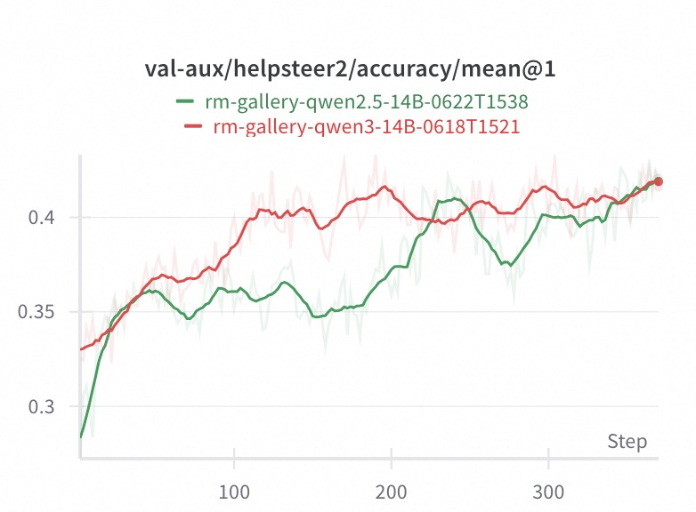
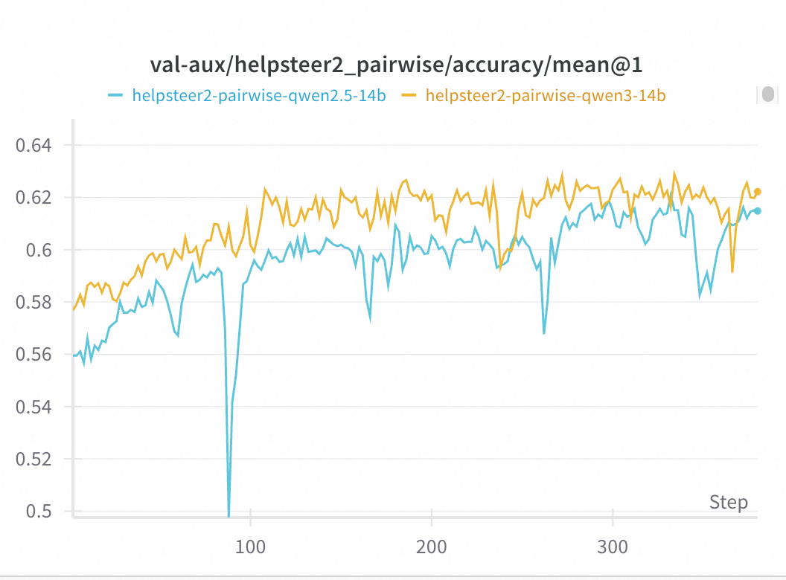

# VERL-based Reward Model Training Complete Guide

## 1. Overview

This document provides a comprehensive guide for training reward models using the VERL framework. Through this tutorial, you will learn how to configure the environment, prepare data, design reward functions, and execute the training pipeline.

This guide covers two main training approaches:
- **Pointwise Training**: Absolute scoring based on individual responses (0-4 scale)
- **Pairwise Training**: Relative preference judgments based on response comparisons

We will use the HelpSteer2 dataset as concrete examples, providing end-to-end implementation demonstrations.

## 2. System Architecture

The VERL reward model training system consists of three core components:

### 2.1. **Training Dataset** - Inherits from `BaseTrainDataset`
   - Supports 0-4 scale helpfulness scoring (Pointwise)
   - Supports preference comparison evaluation (Pairwise)
   - Provides flexible conversation template system
   - Integrates custom reward functions

### 2.2. **Prompt Template** - Based on `BasePromptTemplate`
   - Defines structured output format for scoring
   - Supports extensible scoring criteria
   - Adapts to different evaluation tasks

### 2.3. **Reward Function** - Customizable reward computation module
   - Supports exponential decay reward calculation
   - Provides flexible evaluation metric configuration
   - Real-time accuracy and MAE statistics

## 3. Environment Configuration

### 3.1. System Requirements

| Component | Recommended Version |
|-----------|-------------------|
| Python    | ≥ 3.10 |
| CUDA      | ≥ 12.1 |
| PyTorch   | ≥ 2.1 |
| Ray       | ≥ 2.9 |
| VERL      | ≥ 0.4.0 |
| VLLM      | ≥ 0.8.4 |

### 3.2. Runtime Configuration

Create a `runtime_env.yaml` configuration file:

```yaml
# runtime_env.yaml
excludes: ["/.git/"]
env_vars:
  TORCH_NCCL_AVOID_RECORD_STREAMS: "1"
  PYTORCH_CUDA_ALLOC_CONF: "expandable_segments: False"
  WANDB_API_KEY: "your_wandb_api_key"
  WANDB_BASE_URL: "your_wandb_base_url"
  HYDRA_FULL_ERROR: "1"
```

### 3.3. Dependency Installation

Ensure the following core dependencies are installed:
- `verl==0.4.0` (core framework)
- `ray>=2.9` (distributed computing)
- `vllm>=0.8.4` (inference engine)
- `torch>=2.1` (deep learning framework)

---

## 4. Quick Start

### 4.1. Prepare Training Data

Training data should conform to the `DataSample` format specification. For detailed data loading and preprocessing steps, please refer to the data loading section.

### 4.2. Launch Ray Distributed Cluster

#### 4.2.1. Single Node Setup
Example for a **single node with 8 × A100**:

```bash
ray start --head --node-ip-address $MASTER_ADDR --num-gpus 8 --dashboard-host 0.0.0.0
```

#### 4.2.2. Multi-Node Setup
**Master Node:**
```bash
ray start --head --node-ip-address $MASTER_ADDR --num-gpus 8
```

**Worker Nodes:**
```bash
ray start --address=$MASTER_ADDR:6379 --num-gpus 8
```

### 4.3. Choose Training Mode

Select the appropriate training mode based on your needs:

#### 4.3.1. Pointwise Training (Absolute Scoring)
```bash
cd examples/train/pointwise
chmod +x run_pointwise.sh
./run_pointwise.sh
```

#### 4.3.2. Pairwise Training (Preference Comparison)
```bash
cd examples/train/pairwise
chmod +x run_pairwise.sh
./run_pairwise.sh
```

---

## 5. Pointwise Training Detailed Guide

> Pointwise training is suitable for absolute scoring scenarios, such as HelpSteer2's 0-4 scale helpfulness scoring.

### 5.1. Data Download

HelpSteer2 dataset: <https://huggingface.co/datasets/nvidia/helpsteer2>

```bash
# Create data directory
mkdir -p ~/data/HelpSteer2 && cd ~/data/HelpSteer2

# Download dataset
git clone https://huggingface.co/datasets/nvidia/helpsteer2
```

### 5.2. Data Conversion

#### 5.2.1. Prepare YAML Configuration

`examples/train/pointwise/data_config.yaml`:

```yaml
dataset:
  name: helpsteer2_pointwise
  configs:
    type: local
    source: helpsteer2_pointwise
    path: ~/data/HelpSteer2/helpsteer2
  export:
    output_dir: ./examples/data/exports
    formats: ["parquet"]
    preserve_structure: true
    split_ratio: {train: 0.8, test: 0.2}
```

#### 5.2.2. Execute Conversion

```bash
python examples/data/data_from_yaml.py \
       --config examples/train/pointwise/data_config.yaml
```

### 5.3. Training Script Configuration

Check key configurations in `examples/train/pointwise/run_pointwise.sh`:

```bash
TRAIN_FILE=./examples/data/exports/helpsteer2_train.parquet
VAL_FILE=./examples/data/exports/helpsteer2_test.parquet
MODEL_PATH=/path/to/your/base/model  # e.g., Qwen3-8B
```

### 5.4. Pointwise Core Components

#### 5.4.1. Data Converter
- File: `rm_gallery/gallery/data/load/helpsteer2_pointwise.py`
- Class: `HelpSteer2PointwiseConverter`
- Function: Convert raw HelpSteer2 data to `DataSample` with helpfulness scores

#### 5.4.2. Prompt Template
```python
class PointwiseTrainTemplate(BasePromptTemplate):
    score: int = Field(default=..., description="helpfulness score from 0 to 4")
```

#### 5.4.3. Reward Function
```python
def pointwise_reward(predicted_score, true_score):
    """Reward function optimized for HelpSteer2's 0-4 scale"""
    if true_score is None:
        return 0.0

    abs_error = abs(predicted_score - true_score)
    max_error = 4  # HelpSteer2 scale: 0-4

    k = 2.0  # Decay coefficient
    error_ratio = abs_error / max_error
    reward = math.exp(-k * error_ratio)

    return float(reward)
```

### 5.5. Training Results & Evaluation

#### 5.5.1. Model Performance Comparison

We conducted pairwise training experiments using two different base models on the HelpSteer2 pointwise dataset:

- **Qwen2.5-14B**: Traditional language model
- **Qwen3-14B**: Reasoning-enhanced model

#### 5.5.2. Validation Accuracy Results



The training curves show validation accuracy on the test dataset over 350 training steps:

**Key Observations:**

1. **Qwen3-14B Performance** (Red line):
   - Rapid convergence in early training, reaching high accuracy within ~50 steps
   - Achieves peak performance around step 200 (~0.42 accuracy)
   - Stable training process with minimal fluctuations
   - Final accuracy stabilizes around 0.42

2. **Qwen2.5-14B Performance** (Green line):
   - Lower starting accuracy (~0.28)
   - Notable fluctuations and drops during training
   - Performance decline in the 200-250 step range
   - Recovery in later stages (after step 300), approaching Qwen3-14B levels

3. **Comparative Analysis**:
   - **Convergence Speed**: Qwen3-14B converges faster with higher training efficiency
   - **Stability**: Qwen3-14B shows smoother training curve, while Qwen2.5-14B exhibits larger fluctuations
   - **Final Performance**: Both models achieve similar final accuracy (~0.42)
   - **Training Characteristics**: Qwen3-14B demonstrates superior training stability and predictability

---

## 6. Pairwise Training Detailed Guide

> Pairwise training is suitable for preference comparison scenarios, judging which of two responses is better.

### 6.1. Data Download

HelpSteer2 preference dataset: <https://huggingface.co/datasets/nvidia/HelpSteer2/tree/main/preference>

```bash
# Create data directory
mkdir -p ~/data/HelpSteer2 && cd ~/data/HelpSteer2

# Download preference data
wget -c https://huggingface.co/datasets/nvidia/HelpSteer2/resolve/main/preference/preference.jsonl.gz

# Extract (keep original file)
gunzip -k preference.jsonl.gz
```

### 6.2. Data Conversion

#### 6.2.1. Prepare YAML Configuration

`examples/train/pairwise/data_config.yaml`:

```yaml
dataset:
  name: helpsteer2_pairwise
  configs:
    type: local
    source: helpsteer2_pairwise
    path: ~/data/HelpSteer2/preference/preference.jsonl
  export:
    output_dir: ./examples/data/exports
    formats: ["parquet"]
    preserve_structure: true
    split_ratio: {train: 0.8, test: 0.2}
```

#### 6.2.2. Execute Conversion

```bash
python examples/data/data_from_yaml.py \
       --config examples/train/pairwise/data_config.yaml
```

### 6.3. Training Script Configuration

Check key configurations in `examples/train/pairwise/run_pairwise.sh`:

```bash
TRAIN_FILE=./examples/data/exports/preference_train.parquet
VAL_FILE=./examples/data/exports/preference_test.parquet
MODEL_PATH=/path/to/your/base/model
```

### 6.4. Pairwise Core Components

#### 6.4.1. Data Converter
- File: `rm_gallery/gallery/data/load/helpsteer2_pairwise.py`
- Class: `HelpSteer2PairwiseConverter`
- Function: Convert raw JSONL to `DataSample` and create both forward & reverse preference pairs

Conversion Logic:
1. Read `prompt`, `response_1`, `response_2`, `preference_strength`
2. Determine preference (>0 → `response_2` is better, <0 → `response_1` is better, 0 → tie)
3. Generate two samples (forward + reverse order)

#### 6.4.2. Prompt Template
```python
class PairwiseComparisonTemplate(BasePromptTemplate):
    think: str       # (optional) chain-of-thought
    preference: str  # A / B / tie

# Example output format:
# <think>...</think>
# <preference>A</preference>
```

#### 6.4.3. Reward Function
- File: `examples/train/pairwise/reward_fn.py`
- Core Function: `compute_score()`

Processing Flow:
1. Parse model output with `extract_preference_from_response(solution_str)`
2. Compare with `metadata.preferred` to produce reward: 1.0 (correct) / 0.0 (wrong)

### 6.5. Training Results & Evaluation

#### 6.5.1. Model Performance Comparison

We conducted pairwise training experiments using two different base models on the HelpSteer2 preference dataset:

- **Qwen2.5-14B**: Traditional language model
- **Qwen3-14B**: Reasoning-enhanced model

#### 6.5.2. Validation Accuracy Results



The training curves show validation accuracy on the test dataset over 350 training steps:

**Key Observations:**

1. **Qwen3-14B Performance** (Orange line):
   - Achieves higher overall accuracy (~0.62)
   - More stable training progression
   - Better convergence characteristics
   - Consistent performance throughout training

2. **Qwen2.5-14B Performance** (Blue line):
   - Slightly lower accuracy (~0.61)
   - More volatile training curve with occasional drops
   - Shows improvement in later training stages
   - Reasonable final performance despite fluctuations

3. **Comparative Analysis**:
   - **Accuracy Gap**: ~1% difference favoring Qwen3-14B
   - **Stability**: Qwen3-14B demonstrates superior training stability
   - **Convergence**: Both models show good learning progression
   - **Final Performance**: Both achieve >60% accuracy on preference prediction

#### 6.5.3. Cross-Dataset Evaluation: RM-Bench Results

To further validate the robustness of our trained models, we evaluated the same Qwen2.5-14B model (trained on HelpSteer2 pairwise data) on the RM-Bench dataset:


**RM-Bench Evaluation Results:**

- **Dataset**: RM-Bench (different from training data)
- **Model**: Qwen2.5-14B trained on HelpSteer2 pairwise data
- **Performance**: Achieves ~62.5% accuracy on RM-Bench
- **Training Progression**: Consistent improvement from ~55.8% (baseline Qwen2.5-14B model capability at step 0) to 62.5% over 80+ steps

**Key Insights:**

1. **Cross-Dataset Generalization**: The model trained on HelpSteer2 generalizes well to RM-Bench
2. **Performance Consistency**: Similar accuracy levels across different evaluation datasets
3. **Robust Learning**: Steady improvement curve indicates stable learning dynamics
4. **Practical Validation**: Strong performance on an independent benchmark confirms model quality

#### Practical Implications

- **Model Selection**: Qwen3-14B recommended for production use due to better stability and performance
- **Training Duration**: Both models benefit from extended training (300+ steps)
- **Performance Threshold**: Both models exceed the 60% accuracy threshold for practical deployment
- **Cross-Dataset Robustness**: Models demonstrate good generalization across different preference datasets
- **Resource Efficiency**: The marginal improvement of Qwen3-14B may justify the additional computational cost

---

## 7. Core Component Details

### 7.1. Custom Training Dataset

Complete implementation example of a custom training dataset:

```python
class CustomTrainDataset(BaseTrainDataset):
    def __init__(self, *args, **kwargs):
        # Initialize reward module
        self.reward_module = YourRewardModule(
            name="custom_reward",
            template=YourTemplate,
            examples=self._get_examples(),
            llm=None,
        )
        super().__init__(*args, **kwargs)

    def _build_messages(self, example):
        # Build formatted messages
        result = self.reward_module.format(sample=example)
        return [{"role": "user", "content": result}]
```

> **Important Note: Reasoning Model Configuration**
>
> When training reasoning reward models, pay attention to the following configuration:
> - For reasoning models (e.g., Qwen3):
>   - `apply_chat_template` with `enable_thinking=True`
>   - `format` with `enable_thinking=False`
> - For non-reasoning models:
>   - `apply_chat_template` with `enable_thinking=False`
>   - `format` with `enable_thinking=True`

### 7.2. PPO + GRPO Pipeline

1. **Data Loading**: Ray workers read the dataset and build prompts + ground truth scores
2. **Generation**: **Actor** uses VLLM to generate score predictions in batches
3. **Reward Calculation**: **RewardManager** calls the custom reward_fn to get scalar rewards
4. **Advantage Estimation**: **GRPO Estimator** computes advantages & targets
5. **Policy Update**: **PPO** updates the actor parameters, while the critic learns the value function

---

## 8. Training Monitoring

### 8.1. Logging and Metrics

The training process logs to both **Console** and **Weights & Biases**:

* **Console**: Use `ray job logs <job_id> -f` for real-time logs
* **WandB**: Set `WANDB_API_KEY` and `WANDB_BASE_URL` environment variables to upload metrics automatically

### 8.2. Key Monitoring Metrics

| Metric | Meaning | Target Range |
|--------|---------|--------------|
| `reward/mean` | Mean reward of the current epoch | 0.6 - 1.0 |
| `accuracy` | Accuracy of score predictions | > 0.7 |
| `kl_loss` | KL divergence to the reference model | < 0.1 |

### 8.3. Training Curves

Monitor the training progress through these key curves:

* **Training Reward Curve**: Shows model learning progression on training data
* **Validation Reward Curve**: Indicates generalization performance
* **Loss Curves**: Track convergence of different loss components

---

## 9. FAQ & Troubleshooting

### 9.1. Common Issues and Solutions

#### 9.1.1. **`num_samples=0` error**

   **Problem**: The dataset is empty after filtering.

   **Solution**: Check whether `_build_messages` parses rows correctly:
   ```python
   from examples.train.pointwise.dataset import PointwiseTrainDataset
   ds = PointwiseTrainDataset(...)
   print(len(ds))
   ```

#### 9.1.2. **Ray connection issues**

   **Problem**: Ray can't connect to `127.0.0.1:8265`

   **Solution**:
   - Ensure `ray start --head` has been run
   - Check that port 8265 is reachable
   - Update `--address` parameter in the training script

#### 9.1.3. **Out of Memory Errors**

   **Problem**: CUDA out of memory during training

   **Solutions**:
   - Lower `actor_rollout_ref.rollout.gpu_memory_utilization`
   - Reduce `data.train_batch_size` or `ppo_micro_batch_size_per_gpu`
   - Use gradient checkpointing if available

#### 9.1.4. **Reasoning Model Configuration Issues**

   **Problem**: Incorrect thinking/reasoning token handling

   **Solution**: For reasoning models (e.g., Qwen3):
   - `apply_chat_template` with `enable_thinking=True`
   - `format` with `enable_thinking=False`

   For non-reasoning models:
   - `apply_chat_template` with `enable_thinking=False`
   - `format` with `enable_thinking=True`

#### 9.1.5. **HelpSteer2 Specific Issues**

   **Data Format Validation**:
   ```python
   import pandas as pd
   df = pd.read_parquet('helpsteer2_train.parquet')
   print(df.columns)
   print(df['helpfulness'].value_counts())  # For pointwise
   ```

   **Score Range Configuration**: HelpSteer2 uses 0-4 helpfulness scale, ensure `max_error = 4` is set correctly in `reward_fn.py`.

### 9.2. Performance Optimization Tips

1. **Batch Size Tuning**: Start with smaller batch sizes and gradually increase
2. **Memory Management**: Monitor GPU memory usage with `nvidia-smi`
3. **Ray Resource Allocation**: Ensure proper CPU/GPU resource allocation across Ray workers
4. **Data Loading**: Use efficient data formats (Parquet) and appropriate chunk sizes

---

## 10. Inference & Evaluation

After training, look for **LoRA** or full weights in `checkpoints/<TIMESTAMP>/actor_latest`.

> For evaluation examples, check `external/verl/tests/e2e` or just load the weights for inference.

---

## 11. Related Resources

### 11.1. Tutorial Documentation
- **[Data Processing Tutorial](../data/)** - Comprehensive data handling techniques

### 11.2. Framework Documentation
- **[VERL Framework](https://github.com/volcengine/verl)**: Core training framework
- **[Ray Distributed](https://docs.ray.io/)**: Distributed computing platform
- **[VLLM Inference](https://docs.vllm.ai/)**: High-performance inference engine

### 11.3. Dataset Resources
- **[HelpSteer2](https://huggingface.co/datasets/nvidia/helpsteer2)**: Human preference dataset

---

## 12. Conclusion

This guide provides a complete workflow for training reward models using the VERL framework, including:

1. **System Architecture Understanding**: Core components and working principles
2. **Environment Configuration**: Dependency installation and runtime setup
3. **Data Preparation**: Download, conversion, and formatting
4. **Two Training Modes**: Detailed implementation of Pointwise and Pairwise approaches
5. **Monitoring and Debugging**: Key metrics and troubleshooting
6. **Best Practices**: Performance optimization and configuration recommendations

By following this guide, you can successfully train reward models tailored to your specific needs, whether for absolute scoring or preference comparison tasks.