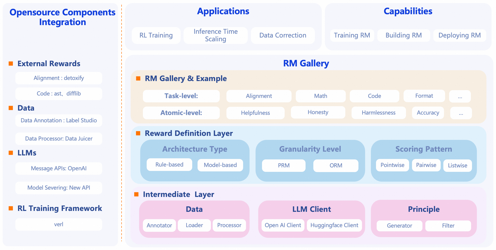
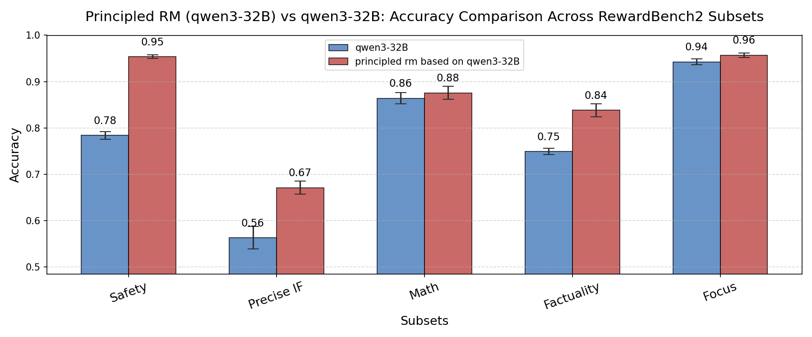
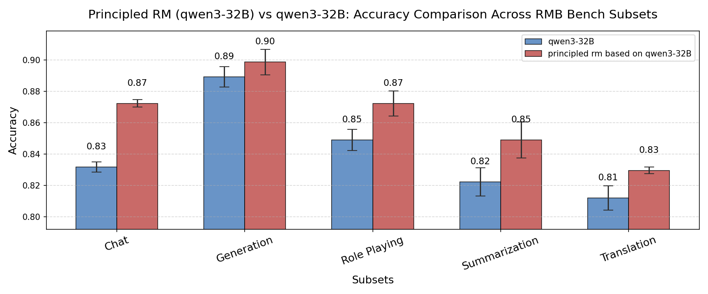

<link rel="preconnect" href="https://fonts.googleapis.com">
<link rel="preconnect" href="https://fonts.gstatic.com" crossorigin>
<link href="https://fonts.googleapis.com/css2?family=Inter:wght@400;500;600;700;800;900&display=swap" rel="stylesheet">

<div style="text-align: center; margin: 3rem 0 2rem 0;">
  <div style="display: inline-block; position: relative;">
    <div style="font-size: 4.5rem; font-weight: 700; letter-spacing: -0.03em; line-height: 0.9; margin-bottom: 1rem; font-family: 'Inter', 'SF Pro Display', -apple-system, BlinkMacSystemFont, 'Segoe UI', Roboto, sans-serif;">
      <span style="background: linear-gradient(135deg, #22d3ee 0%, #3b82f6 30%, #6366f1 70%, #8b5cf6 100%); -webkit-background-clip: text; -webkit-text-fill-color: transparent; background-clip: text; text-shadow: 0 0 25px rgba(59, 130, 246, 0.3);">RM</span><span style="background: linear-gradient(135deg, #6366f1 0%, #8b5cf6 30%, #a855f7 70%, #ec4899 100%); -webkit-background-clip: text; -webkit-text-fill-color: transparent; background-clip: text; text-shadow: 0 0 25px rgba(139, 92, 246, 0.3);">Gallery</span>
    </div>
    <div style="position: absolute; top: -10px; left: -10px; right: -10px; bottom: -10px; background: radial-gradient(ellipse at center, rgba(59, 130, 246, 0.1) 0%, transparent 70%); border-radius: 20px; z-index: -1;"></div>
  </div>
</div>

<div style="display: flex; justify-content: center; align-items: center; gap: 0.5rem; margin: 1.5rem 0; flex-wrap: wrap;">
  <a href="https://pypi.org/project/rm-gallery/" style="text-decoration: none;">
    
  </a>
  <a href="https://pypi.org/project/rm-gallery/" style="text-decoration: none;">
    
  </a>
  <a href="https://github.com/modelscope/RM-Gallery/blob/main/LICENSE" style="text-decoration: none;">
    
  </a>
  <a href="https://github.com/modelscope/RM-Gallery" style="text-decoration: none;">
    
  </a>
</div>

<p align="center">
  <strong>RM-Gallery: A One-Stop Reward Model Platform</strong><br>
  <em>Train, Build, and Apply Reward Models with Ease.</em>
</p>

---

<div style="display: grid; grid-template-columns: repeat(auto-fit, minmax(280px, 1fr)); gap: 1.5rem; margin: 2rem 0;">
  <div style="padding: 1.5rem; border-radius: 12px; background: linear-gradient(135deg, rgba(59, 130, 246, 0.1) 0%, rgba(99, 102, 241, 0.05) 100%); border: 1px solid rgba(59, 130, 246, 0.2);">
    <div style="font-size: 2rem; margin-bottom: 0.5rem;">🚀</div>
    <h3 style="margin: 0 0 0.5rem 0;">Quick Start</h3>
    <p style="margin: 0 0 1rem 0; color: #666;">Get started in 5 minutes</p>
    <a href="quickstart/" style="text-decoration: none; color: #3b82f6; font-weight: 600;">Start Now →</a>
  </div>

  <div style="padding: 1.5rem; border-radius: 12px; background: linear-gradient(135deg, rgba(139, 92, 246, 0.1) 0%, rgba(168, 85, 247, 0.05) 100%); border: 1px solid rgba(139, 92, 246, 0.2);">
    <div style="font-size: 2rem; margin-bottom: 0.5rem;">📚</div>
    <h3 style="margin: 0 0 0.5rem 0;">Tutorials</h3>
    <p style="margin: 0 0 1rem 0; color: #666;">Step-by-step guides</p>
    <a href="tutorial/" style="text-decoration: none; color: #8b5cf6; font-weight: 600;">Learn More →</a>
  </div>

  <div style="padding: 1.5rem; border-radius: 12px; background: linear-gradient(135deg, rgba(16, 185, 129, 0.1) 0%, rgba(5, 150, 105, 0.05) 100%); border: 1px solid rgba(16, 185, 129, 0.2);">
    <div style="font-size: 2rem; margin-bottom: 0.5rem;">📚</div>
    <h3 style="margin: 0 0 0.5rem 0;">RM Library</h3>
    <p style="margin: 0 0 1rem 0; color: #666;">35+ pre-built models</p>
    <a href="library/rm_library/" style="text-decoration: none; color: #10b981; font-weight: 600;">Explore Models →</a>
  </div>

  <div style="padding: 1.5rem; border-radius: 12px; background: linear-gradient(135deg, rgba(236, 72, 153, 0.1) 0%, rgba(219, 39, 119, 0.05) 100%); border: 1px solid rgba(236, 72, 153, 0.2);">
    <div style="font-size: 2rem; margin-bottom: 0.5rem;">❓</div>
    <h3 style="margin: 0 0 0.5rem 0;">FAQ</h3>
    <p style="margin: 0 0 1rem 0; color: #666;">Common questions</p>
    <a href="faq/" style="text-decoration: none; color: #ec4899; font-weight: 600;">Get Answers →</a>
  </div>
</div>

---

## 📢 News
- **[2025-07-09]** We release RM Gallery v0.1.0 now, which is also available in [PyPI](https://pypi.org/simple/rm-gallery/)!

---

## 🌟 Why RM-Gallery?

RM-Gallery is a one-stop platform for training, building and applying reward models. It provides a comprehensive solution for implementing reward models at both task-level and atomic-level, with high-throughput and fault-tolerant capabilities.

<p align="center">
 
 <br/>
 <em>RM-Gallery Framework </em>
</p>

### 🏋️‍♂️ Training RM
- **Integrated RM Training Pipeline**: Provides an RL-based framework for training reasoning reward models, compatible with popular frameworks (e.g., verl), and offers examples for integrating RM-Gallery into the framework.
<p align="center">
  
  <br/>
  <em>RM Training Pipeline improves accuracy on RM Bench</em>
</p>
This image demonstrates the effectiveness of the RM Training Pipeline. On RM Bench, after more than 80 training steps, the accuracy improved from around 55.8% with the baseline model (Qwen2.5-14B) to approximately 62.5%.

### 🏗️ Building RM
- **Unified Reward Model Architecture**: Flexible implementation of reward models through standardized interfaces, supporting various architectures (model-based/free), reward formats (scalar/critique), and scoring patterns (pointwise/listwise/pairwise)

- **Comprehensive RM Gallery**: Provides a rich collection of ready-to-use Reward Model instances for diverse tasks (e.g., math, coding, preference alignment) with both task-level(RMComposition) and component-level(RewardModel). Users can directly apply RMComposition/RewardModel for specific tasks or assemble custom RMComposition via component-level RewardModel.

- **Rubric-Critic-Score Paradigm**: Adopts the Rubric+Critic+Score-based reasoning Reward Model  paradigm, offering best practices to help users generate rubrics with limited preference data.

<div style="display: flex; flex-wrap: wrap;">
  
  
</div>
The two images above show that after applying the Rubric+Critic+Score paradigm and adding 1–3 rubrics to the base model (Qwen3-32B), there were significant improvements on both RewardBench2 and RMB-pairwise.

### 🛠️ Applying RM

- **Multiple Usage Scenarios**: Covers multiple Reward Model (RM) usage scenarios with detailed best practices, including Training with Rewards (e.g., post-training), Inference with Rewards (e.g., Best-of-N，data-correction)

- **High-Performance RM Serving**: Leverages the New API platform to deliver high-throughput, fault-tolerant reward model serving, enhancing feedback efficiency.


## 📥 Installation

> RM Gallery requires **Python >= 3.10 and < 3.13**

=== "From PyPI"

    ```bash
    pip install rm-gallery
    ```

=== "From Source"

    ```bash
    # Pull the source code from GitHub
    git clone https://github.com/modelscope/RM-Gallery.git
    cd RM-Gallery

    # Install the package
    pip install .
    ```

## 🚀 Quick Start

Get started with RM-Gallery in just a few lines of code:

```python
from rm_gallery.core.reward.registry import RewardRegistry

# Use a built-in reward model
rm = RewardRegistry.get("harmlessness")

# Evaluate your data
result = rm.evaluate(sample)
```

Ready to dive deeper? Check out our [**Quickstart Guide**](quickstart.md) for a complete walkthrough, or explore our [**Tutorials**](tutorial/README.md) for specific use cases.

---

## 🎯 Core Capabilities

### 🏋️‍♂️ Training RM

Train custom reward models with our integrated pipeline, supporting both pointwise and pairwise paradigms. Compatible with popular frameworks like VERL for reinforcement learning.

**Key Features:**
- Pointwise & pairwise training modes
- Distributed training support (Ray)
- Integration with RLHF pipelines

[**→ Training RM Tutorial**](tutorial/training_rm/overview.md)

---

### 🏗️ Building RM

Build reward models tailored to your needs with our flexible architecture.

**35+ Pre-built Models** covering:
- 🧮 **Math**: Mathematical correctness verification
- 💻 **Code**: Code quality and execution assessment
- 🎯 **Alignment**: Helpfulness, harmlessness, honesty
- 📊 **General**: Accuracy, F1, ROUGE metrics
- ✍️ **Style**: Format, length, privacy compliance

**Or Build Your Own:**
- Use our Rubric-Critic-Score paradigm
- Customize LLM templates
- Implement rule-based logic

[**→ View RM Library**](library/rm_library.md) | [**→ Building Guide**](tutorial/building_rm/overview.md)

---

### 🛠️ Applying RM

Put your reward models to work in production scenarios:

- **Best-of-N**: Select top responses from multiple candidates
- **Post-Training**: Integrate with RLHF for model optimization
- **Data Refinement**: Iteratively improve outputs with RM feedback
- **RM Server**: Deploy high-throughput, fault-tolerant RM services

[**→ Application Tutorials**](tutorial/rm_application/post_training.md)


## 🤝 Contribute

Contributions are always encouraged!

We highly recommend install pre-commit hooks in this repo before committing pull requests.
These hooks are small house-keeping scripts executed every time you make a git commit,
which will take care of the formatting and linting automatically.
```shell
pip install -e .
pre-commit install
```

Please refer to our [Contribution Guide](contribution.md) for more details.

## 📝 Citation

Reference to cite if you use RM-Gallery in a paper:

```
@software{
title = {RM-Gallery: A One-Stop Reward Model Platform},
author = {The RM-Gallery Team},
url = {https://github.com/modelscope/RM-Gallery},
month = {07},
year = {2025}
}
```